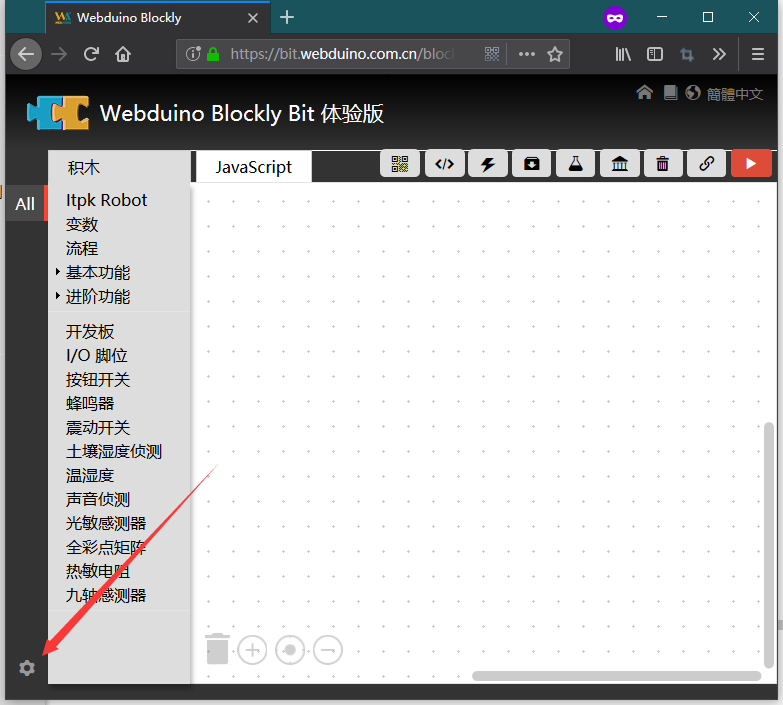
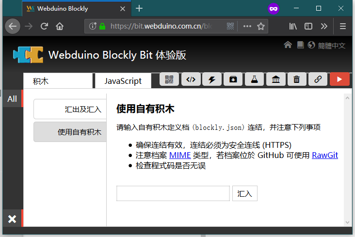
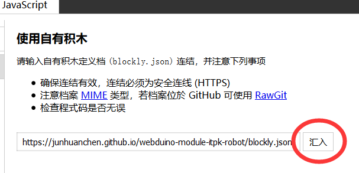
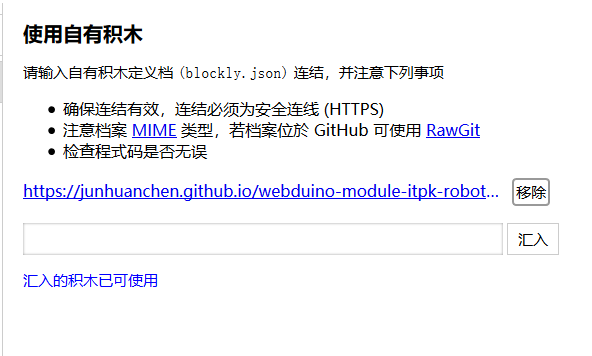
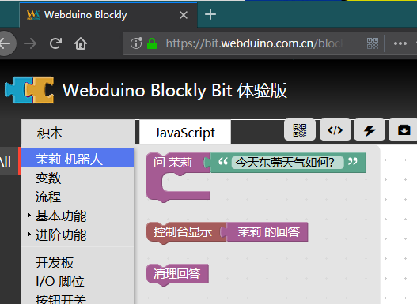
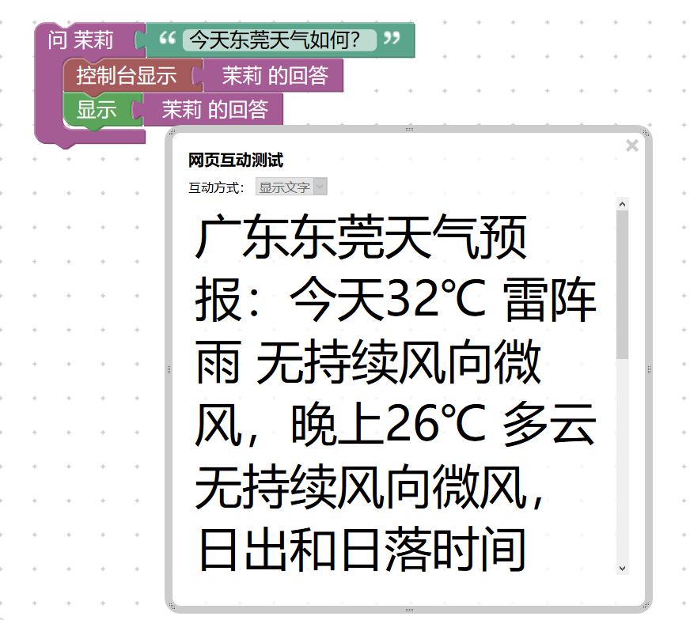
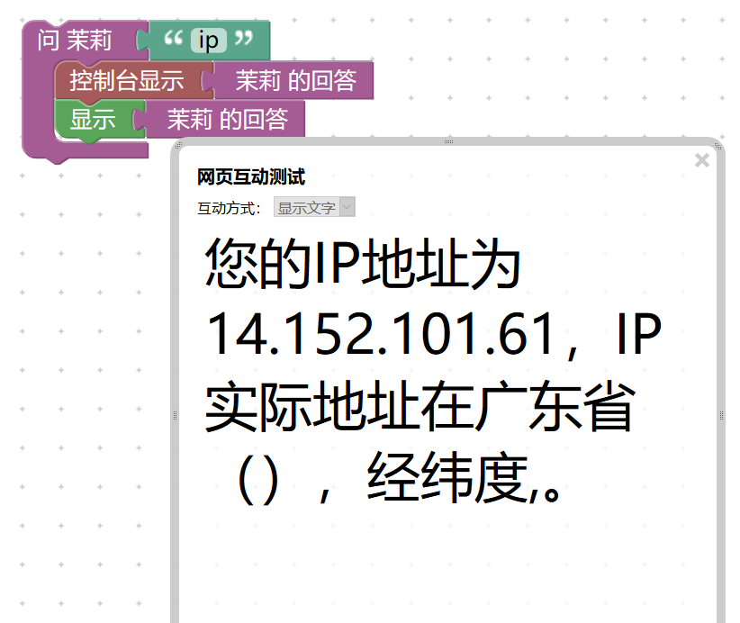

# Webduino Blockly 之 茉莉机器人

本插件地址：`https://junhuanchen.github.io/webduino-module-itpk-robot/blockly.json`

## 前言

积木名称满足以下格式 webduino-module-模块名，例如：webduino-module-itpk-robot。

积木插件结构：（根据 [eim 积木设计文档](https://github.com/junhuanchen/webduino-module-eim) 可知）

- blockly

存放 blockly 积木有关的资源

- blockly/blocks.js

积木的样式设计代码，由 blockly 自动生成，但需要最终添加语言包。

- blockly/javascript.js

积木产生代码的生成代码，由 blockly 自动生成，但需要最终添加 代码生成函数 链接起来。

- blockly/msg

存放 简、繁、英的变量语言包

- demos/blockly.xml

存放现在积木的运行示例，你只需要在载入插件的时候，载入外部积木即可运行我的测试案例。

- demos/library.xml

存放现在积木的设计器（Blockly Tool）布局文件。

- *.js（如 itpk.js）

属于 Js Bin 中可直接运行的 浏览器 js 代码，并非 Nodejs。

- *-blockly.js（如 itpk-blockly.js）

配合 stringFormat.js 完成对积木生成代码的 字符串格式化（stringFormat） 生成 js 代码。

以上就是我设计积木的常见结构，如果有更好的建议，或想同我交流的，欢迎 @ 我。

## 使用方法

进入 [ webduino blockly ](https://bit.webduino.com.cn/blockly/?lang=zh-hans)。

点击左下角的 菜单键（设置） 然后可以看到 使用自有积木。

在该框粘贴本文开头的插件地址并点击 汇入 即可。

汇入成功，再次点击 左下角的 × 返回主页吧。

此时你可以在主页的菜单们看到它了，剩下的看使用方法吧。

想要运行示例代码，需下载项目的 demos/blockly.xml 文件并导入。

## 功能说明

接下来说说这个积木的功能，如下图。

你只需要将更换要问茉莉的内容就可以了。

注意，这个积木是异步执行的，所以建议同步有序执行即可，不然可能会答非所问。

## 文档介绍

到这里来玩玩吧~

[机器人 API ](http://www.itpk.cn/robot.php)

例如下图的指令。

## 最后，更多的积木，可以在 github 搜索 webduino-module 获得。
